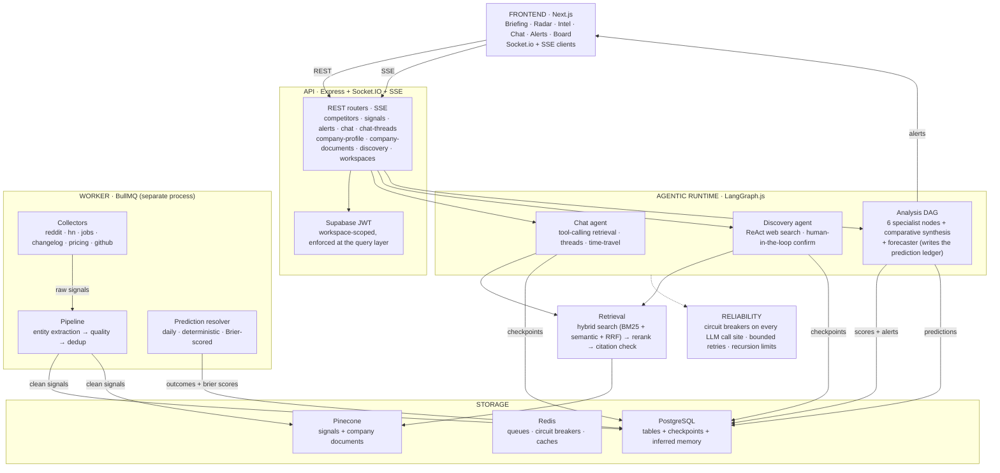

# Signal

Signal replaces your competitive analyst — it runs permanently, gets smarter the longer it runs, and tells your team what to do before your competitors announce it.

---

## What It Is

Product and growth teams at Series B+ B2B SaaS companies spend $40K+/year on tools like Crayon and Klue, plus 10 hours a week of analyst time, to produce battlecards that are outdated the moment they're published. Those tools automate collection — a changed pricing page, a new job posting — but a human still has to figure out what it means and what to do about it.

Signal is the analyst. You add a competitor once and it monitors five public sources permanently: Reddit, Hacker News, job boards, RSS changelogs, and pricing pages. A quality-scoring and semantic-deduplication pipeline cleans every incoming signal, a multi-agent LangGraph.js system interprets it, and an alert is generated when a competitor's move opens a vulnerability window worth acting on — with a chain of evidence, a confidence score backed by historical backtesting, and specific recommended actions.

It gets better over time. Every analysis run stores its signal pattern alongside what actually happened next. Six months of accumulated behavioral fingerprints on a competitor produce materially better predictions than six days — a moat a team starting fresh cannot replicate no matter how much they pay for Crayon.

---

## Sample Output

```
STRATEGIC SIGNAL DETECTED  ·  HIGH CONFIDENCE  ·  81%

Competitor: Notion
Pattern: Upmarket Pivot + AI Feature Push

Evidence chain:
  [1] 5 ML Engineer posts in 7 days (3x normal velocity)
      3 of 5 JDs reference "embedding models" and "semantic search"
  [2] Changelog: "improved search relevance" shipped 12 days ago
  [3] Pricing: free plan removed, Pro raised $8/month
  [4] Reddit r/Notion: "too expensive for small teams" up 340% this week
  [5] G2: 14 new 3-star reviews citing pricing in last 10 days

Interpretation:
  Deliberate upmarket pivot. SMB segment being abandoned.
  AI search feature likely 30-60 days out.

Vulnerability window: OPEN  ·  ~45 days
  ~40% of their user base used the free tier.
  They are looking for alternatives right now.

Recommended actions:
  POSITIONING  Lead with SMB simplicity and transparent pricing
  CONTENT      Publish a head-to-head comparison for small teams
  OUTREACH     Engage r/Notion and r/productivity communities
  COPY         "We don't charge you more for growing."
  TIMING       Act within 21 days before the window closes
```

---

## How It Works

**Add a competitor by name and domain.** Signal discovers everything else automatically — subreddits, job boards, pricing pages, changelog feeds. It also proposes new competitors you haven't thought to add, and asks you to confirm each one before it starts tracking it.

**Briefing.** The default view your team opens every morning. The top 3 most significant competitive movements from the last 24 hours — what happened, why it matters, the recommended action, and a one-click button to act on it.

**Radar.** Per-competitor trend view — Signal Score over time, mention volume, sentiment trajectory, department hiring velocity. The view for "what's this competitor's trajectory."

**Intel.** The full signal feed, filterable by source, competitor, signal type, quality score, and date range. The view for "show me everything."

**Chat.** A persistent, multi-thread panel that answers questions from accumulated intelligence, not generic LLM knowledge. It retrieves and re-queries Signal's own stored evidence before answering, cites its sources, and declines rather than guessing when the evidence is thin. Threads are checkpointed — you can rewind any answer and regenerate from there.

**Chat as a control plane.** You can also *act* through the chat: create a competitor, trigger an analysis run, kick off a discovery search, or edit the company's goals/plans by talking to it. Every mutating action is gated — the agent proposes, then asks you to confirm before anything touches data.

**Prediction ledger.** Signal writes down what it thinks a competitor will do next — as a dated claim with a stated probability, machine-checkable resolution criteria, and the evidence count behind it. When the date arrives, a resolver settles it against evidence actually collected and marks it hit, miss, or unresolved. Nothing is ever presented as certain, and every claim is scored later whether it was right or not.

Two rules make the ledger worth reading. Predictions only get made above an evidence floor, so the system abstains far more often than it speaks. And an unresolved window — one that closed with no evidence either way — is recorded as unresolved rather than counted as a miss, because abstaining is not the same as being wrong.

**Calibration.** Every resolved prediction is Brier-scored, and the workspace's running score sits next to the 0.25 baseline you would get by saying "maybe" to everything. A Brier score is a proper scoring rule: it is minimised by stating your true belief, so overclaiming confidence costs you when you are wrong and hedging costs you when you are right. A workspace with nothing resolved yet shows no score at all — never a zero, which would read as perfection.

**Signal Score.** A 0-100 composite threat score per competitor, recomputed daily: mention velocity (30-day trend, quality-weighted), sentiment trajectory, hiring momentum (department deltas, especially ML/AI/Sales), pricing change recency, and vulnerability window status. It's the 10-second daily check-in before anyone drills into detail.

**Own-company monitoring.** Signal watches your own company the same way it watches competitors — upload your docs and it produces "competitor did X, we haven't" comparisons. Advisory only: it informs, it never acts.

**Company Profile.** Signal learns your product, pricing, ICP, and differentiators from documents you upload plus a short setup. Every analysis agent uses this context to produce recommendations specific to your company — not generic advice about what a competitor is doing.

---

## Architecture



Three LangGraph graphs, one per surface, plus a deterministic resolver that closes the loop:

- **Chat agent** — tool-calling retrieval: the model re-queries Signal's stored evidence (`hybridRetrieve → rerank → enforceCitations`) before answering, with citation-grounded answers and structured refusals instead of guesses. Checkpointed for multi-turn threads and time-travel.
- **Discovery agent** — a bounded ReAct loop over DuckDuckGo web search + Signal's own retrieval that proposes new competitors; each candidate is gated behind a human confirmation step, never auto-tracked.
- **Analysis DAG** — a fixed 6-node pipeline (intent, sentiment, change, pattern, vulnerability, synthesis) that scores every competitor daily, plus a conditional comparative-synthesis node for own-company monitoring, and a forecaster that runs last and writes the prediction ledger. Deterministic where possible; LLM only where reasoning is required.
- **Prediction resolver** — not a graph and not an agent. A daily BullMQ sweep that settles due predictions by matching rows in code, so the one number the product stakes its credibility on is never produced by something that wants to please the reader.

All three run behind the same reliability layer: circuit breakers on every LLM call site, native retry policies (429/5xx/timeout only), and explicit recursion limits so no agent loop can spin forever.

---

## Tech Stack

### Backend

| | |
|---|---|
| **Node.js 20 / TypeScript 5** | Strict mode throughout. Discriminated unions for circuit states, generics for retry utilities, `satisfies` for config. |
| **Express** | REST API and Socket.io host. Global error handler, per-route Zod validation, `requireAuth` middleware verifying Supabase JWTs and stamping `req.workspaceId`. |
| **LangGraph.js** | Stateful directed graphs with parallel nodes, conditional edges, tool-calling, checkpointing, and immutable state transitions. |
| **BullMQ** | A dedicated queue per collector, pipeline stage, discovery, and analysis job. Per-queue rate limiting, dead-letter queues, cron scheduling. Worker runs as a separate process. |
| **Socket.io** | Real-time alert delivery through a cross-process Redis relay, joined to workspace-scoped rooms. |
| **Zod** | All LLM outputs validated on receipt. Schema failure fed back to the model for self-correction, then fail-fast. |
| **Drizzle ORM** | Type-safe schema and queries. Migrations tracked and version-controlled. |
| **flexsearch** | BM25 keyword index for hybrid retrieval, combined with semantic search via reciprocal rank fusion. |

### Data

| | |
|---|---|
| **PostgreSQL (Supabase)** | Primary store — competitors, signals, signal_clusters, pricing_diffs, agent_runs, prompt_versions, agent_test_cases, circuit_events, llm_costs, alerts, competitor_signal_scores, predictions, company_profile, company_documents, tracked_entities, chat_threads, competitor_discovery_log. Also holds LangGraph checkpoints (thread state) and inferred cross-thread memory. |
| **Redis (Upstash)** | BullMQ backend, circuit breaker state (shared across worker instances), chat response cache, company profile cache. |
| **Pinecone** | Signals embedded and namespaced per competitor; company documents embedded under a per-workspace `profile:` namespace. `quality_score` in vector metadata for weighted retrieval. |

### AI

| Model | Agents | Reason |
|---|---|---|
| GPT-4.1 | IntentAnalyzer, PatternDetector, VulnerabilityDetector (analysis) | Multi-signal reasoning across large context windows |
| GPT-4o-mini | ChangeDetector, EntityExtractor, PricingExtractor | Structured extraction — cheaper, sufficient accuracy |
| Claude Sonnet | SynthesisAgent, ComparativeSynthesis, ChatAgent, Forecaster, VulnerabilityDetector (copy) | Writing quality matters for user-facing output |
| Claude Haiku | SentimentClusterer, document classifier | Fast, cheap classification |
| text-embedding-3-small | All embeddings | Cost-efficient semantic accuracy |
| Cohere rerank-english-v3.0 | ChatAgent reranking | Jointly scores (query, chunk) pairs — improves retrieval precision over vector similarity alone |

### Frontend

| | |
|---|---|
| **Next.js** | Command center — landing, Briefing, Radar, Intel, Discovery, Company, Chat, Alerts, Board, Settings |
| **Recharts** | Signal Score sparklines, mention volume trends, sentiment over time, department hiring charts |
| **Socket.io client** | Real-time alert display |

### Infra

| | |
|---|---|
| **Docker + docker-compose** | Four services: `api`, `worker`, `postgres`, `redis`. API and worker are separate — background processing does not share a process with the HTTP server. |
| **GitHub Actions** | Type check, test, and build on every push; RAG faithfulness gate on every push. |
| **LangSmith** | Native LangGraph tracing: every node execution, state transition, and LLM call logged automatically. Prompt versioning, evaluation datasets, and a debugging UI for agent runs. |

---

## Agents

### Discovery

**Metadata discovery** — no LLM. Triggered once when a competitor is added. Discovers subreddits (Reddit search API, ranked by mention frequency), job board tokens (Greenhouse + Lever pattern matching), pricing URL (common path probing with a web-search fallback), and RSS/changelog feed (path probing plus HTML parsing). Logs every attempt to `competitor_discovery_log`.

**Competitor discovery** — LLM. A separate LangGraph agent that *proposes brand-new competitors* you haven't added. A tool-calling model (DuckDuckGo web search + Signal's own retrieval) runs a bounded ReAct loop and proposes up to 5 candidates. Each lands in `tracked_entities` as a `candidate` and is promoted only through explicit human confirmation — never automatically.

### Collection — no LLM

| Agent | Schedule | Source |
|---|---|---|
| RedditCollectionAgent | Every 6h | Reddit OAuth API · rate limiter at 50 req/min |
| HNCollectionAgent | Every 6h | Algolia HN API · no auth · weighted 2x in PatternDetector |
| JobPostingCollectionAgent | Every 24h | Greenhouse + Lever public APIs · delta only against stored baseline |
| ChangelogCollectionAgent | Every 12h | RSS/Atom feeds · Cheerio for full-text content |
| PricingWatcherAgent | Every 48h | Playwright · structured extraction · always closes the browser |
| GithubCollectionAgent | Every 6h | GitHub REST API · releases, pull requests, new repositories · authenticated rate limit |

Signals over 500 tokens are chunked at 400 tokens with 50-token overlap before embedding.

### Signal processing pipeline — three BullMQ stages, in order

**EntityExtractor** (GPT-4o-mini) pulls structured data from signal text — pricing figures, product names, feature names, competitor references — stored as JSONB for SQL queries. A failure is caught and logged; the pipeline still advances.

**QualityScorer** assigns a `quality_score` from 0.0–1.0 using source authority, log-scaled engagement, and exponential recency decay. The score propagates into Pinecone metadata and Signal Score weighting.

**SemanticDeduplicator** embeds each signal and merges it into an existing cluster when cosine similarity exceeds 0.88 (calibrated against 200 labeled pairs). Clusters track a canonical summary and corroboration count; multiple sources confirming the same event raise confidence directly.

### Analysis — LangGraph.js

**IntentAnalyzer** (GPT-4.1) — infers hiring intent from the last 7 days of job postings. Every inference cites specific titles and phrases; low-support claims are marked low-confidence.

**SentimentClusterer** (Claude Haiku) — clusters community sentiment into new vs. chronic complaints, so Signal distinguishes a fresh problem from a long-standing one.

**ChangeDetector** (GPT-4o-mini) — conditional node that fires only when a pricing diff landed; extracts old/new price from the diff.

**PatternDetector** (GPT-4.1) — volume trends computed in SQL, interpretation in the LLM. Once a competitor has 90+ days of history, it retrieves historically similar signal patterns and weights the current prediction by what happened after past occurrences — the compounding moat.

**VulnerabilityWindowDetector** (GPT-4.1 + Claude Sonnet) — GPT-4.1 identifies the vulnerable segment and window; Claude Sonnet writes the positioning copy. Two models because the tasks need different capabilities.

**SynthesisAgent** (Claude Sonnet) — the fan-in. Computes the daily Signal Score, incorporates corroboration, and decides real-time alert vs. digest vs. suppress.

**Forecaster** (Claude Sonnet) — the last node in the DAG, and the one that most often says nothing. Below an evidence floor of five distinct signal clusters it does not call the model at all: a model handed four signals will still produce three fluent, confident forecasts, so the only reliable defence is not to ask. Above the floor it emits at most three dated predictions, each with a probability bounded away from 0 and 1, and each carrying resolution criteria a machine can later check. Forecasts that repeat an already-open prediction of the same pattern and timeline are dropped, so the daily sweep cannot fill the ledger with near-duplicates that each resolve separately and inflate the track record.

**ComparativeSynthesis** (Claude Sonnet) — for own-company monitoring only. Runs when the analyzed row is the workspace's own-company row and produces "competitor did X, we haven't — possible reasons, possible responses." Advisory only.

### Resolution — no LLM

**PredictionResolver** — a daily sweep (01:00 UTC, an hour after the analysis sweep so the day's collection has landed) that settles every prediction whose date has passed.

No language model decides a verdict. A model asked "did this come true?" will find a way to say yes — it is agreeable, it has the prediction in front of it, and partial matches read as success in prose. A product whose entire claim is an honest track record cannot have its scoring done by something biased toward pleasing the reader. So resolution is row matching in code: `signal_match` requires every term to appear across the window's signals, `github_release` requires both the repo and `/releases/` in the URL so a pull request cannot satisfy a prediction that said ship, and `pricing_change` matches a recorded diff's direction.

A miss has to be earned by evidence that existed and disagreed. When the window closed with too little activity to judge either way, the outcome is `unresolved` and no Brier score is stored — otherwise Signal would be scoring itself on competitors that went quiet and on its own collection gaps.

### Chat — Claude Sonnet

Real-time, tool-calling retrieval, not a fixed pipeline: the model re-queries Signal's stored evidence with refined terms until it has enough to answer, then the answer is citation-checked. A grounded answer cites its sources; insufficient evidence returns a structured refusal instead of a low-quality guess. Answers stream live over SSE, threads are checkpointed for memory, and any past answer can be regenerated from its checkpoint.

---

## API

All routes are authenticated with a Supabase JWT (`Authorization: Bearer …`) and workspace-scoped — every request resolves to the caller's `workspace_id`, and rows from other workspaces are never returned.

| Area | Endpoints |
|---|---|
| Competitors | `GET/POST /api/competitors`, `GET /api/competitors/:id`, `POST /:id/analyze`, `GET /:id/score`, `GET /:id/scores`, `GET /:id/trend`, `GET /:id/hiring`, `GET /:id/discovery` |
| Signals | `GET /api/signals` (pagination, source/quality/date filters) |
| Alerts | `GET /api/alerts` |
| Chat | `POST /api/chat` — SSE: `event: token`* → `event: result` · `event: confirm_required` |
| Chat threads | `POST/GET /api/chat-threads`, `GET /:id/messages`, `GET /:id/checkpoints`, `POST /:id/regenerate`, `POST /:id/resume`, `GET /pending-confirmations`, `DELETE /:id` |
| Company goals | `GET/POST /api/company-goals`, `PATCH/DELETE /api/company-goals/:id` |
| Company profile | `GET/POST /api/company-profile`, `GET/PUT /api/company-profile/signal-goal` |
| Company documents | `GET/POST /api/company-documents` (file upload), `POST /api/company-documents/text` (pasted text) |
| Discovery | `GET /api/tracked-entities`, `POST /api/discovery/trigger`, `POST /api/discovery/:threadId/resume` (`{decision: "confirm" \| "dismiss"}`) |
| Dashboard | `GET /api/dashboard/summary` |
| Workspaces | `GET/POST/PATCH /api/workspaces` |

Chat answers arrive as SSE frames: `token` frames stream the draft live, then a `result` frame carries the citation-checked answer (or a structured refusal). The regenerated answer from `POST /api/chat-threads/:id/regenerate` forks a fresh branch from a checkpoint — the original thread history is untouched.

---

## Evaluation

Signal ships evaluation harnesses that run in CI and on demand, but no benchmark results are published here — the product hasn't yet been run against a verified dataset, so there are no claimed accuracy numbers.

- **Backtesting** (`npm run backtest:full`): replays human-verified historical events against the pipeline and reports lead time, confidence, and correctness. The harness is built and a verified case file has been started (`apps/api/fixtures/backtest-ground-truth.json`) — two real devtool launches, every date and URL read from the vendor's own blog. It is deliberately not a benchmark yet: two positive cases and no controls would produce a number that is noise, and `apps/api/fixtures/README.md` states exactly what has to happen before one is published. No accuracy figure is claimed here until that work is done.
- **Prompt versioning** (`npm run eval` / `npm run promote`): every prompt change is gated by a regression suite, and promotion requires a statistically significant improvement over the active version.
- **Deduplication calibration** (`npm run dedup-calibration`): scores the dedup threshold against human-labeled pairs and recommends a value without ever editing the runtime threshold.
- **RAG quality** (`npm run rag-eval`): runs curated Q&A pairs through the chat pipeline and scores faithfulness with an LLM judge. It runs in CI and fails the build below a configured threshold.
- **Calibration**: unlike the harnesses above, this is not a script — it is the product measuring itself continuously. Every resolved prediction contributes a Brier score, and the workspace aggregate is queryable per competitor and per pattern type. No accuracy figure is published here yet: the ledger has to accumulate resolved predictions before a score means anything, and a number produced before then would be noise presented as evidence.

---

## Cost

Every LLM call is cost-tracked (`llm_costs`) and routed through an adaptive model selector that downgrades to cheaper models under budget pressure. Analysis agents run on a daily cadence and dominate cost; chat is on-demand. No per-agent cost figures are published — they're measured from real usage, not estimated.

---

## Latency

Per-node timing is recorded in `agent_latencies` and reported by `npm run latency-report` (P50/P95/P99 per agent, failure rates, and per-day LLM cost). No latency targets or measurements are claimed here yet.

---

## Project Structure

```
signal/
├── package.json                         # npm workspaces root
├── docker-compose.yml                   # api, worker, postgres, redis
├── .github/workflows/ci.yml             # typecheck + test + build + RAG gate
│
├── packages/
│   └── shared/                          # Zod schemas + TypeScript types shared by api & web
│
└── apps/
    ├── api/                             # Backend: Express + BullMQ + LangGraph
    │   ├── src/
    │   │   ├── api/                     # Express routers + Socket.io server
    │   │   │   ├── competitors.ts       # CRUD + discovery trigger + analyze + score/trend/hiring
    │   │   │   ├── signals.ts           # signal feed (pagination + filters)
    │   │   │   ├── alerts.ts            # alert history
    │   │   │   ├── chat.ts              # chat SSE endpoint
    │   │   │   ├── chat-threads.ts      # thread CRUD + messages + checkpoints + regenerate
    │   │   │   ├── company-profile.ts   # company profile
    │   │   │   ├── company-documents.ts # doc upload + paste
    │   │   │   ├── discovery.ts         # discovery trigger + HITL resume
    │   │   │   └── workspaces.ts        # workspace management
    │   │   ├── collectors/              # BullMQ collection workers (no LLM)
    │   │   ├── pipeline/                # entity extraction → quality → dedup
    │   │   ├── agents/
    │   │   │   ├── discovery/           # metadata discovery (no LLM)
    │   │   │   ├── discovery-search/    # LLM competitor-discovery agent (ReAct + HITL)
    │   │   │   ├── analysis/            # 6 analysis nodes + comparative-synthesis + forecaster
    │   │   │   ├── resolver/            # prediction resolution strategies + daily sweep
    │   │   │   └── chat/                # chat graph + adapters
    │   │   ├── graph/                   # analysis-graph DAG + state
    │   │   ├── queues/                  # queue registry + scheduler
    │   │   ├── db/                      # Drizzle schema + queries
    │   │   ├── vector/                  # Pinecone (namespaced)
    │   │   ├── retrieval/               # hybrid-retrieval + reranker + citation-enforcer + tool
    │   │   ├── llm/                     # adaptive router + prompt registry + cost tracker
    │   │   ├── reliability/             # circuit breaker (+ event log)
    │   │   └── lib/                     # logger, retry, latency-tracker, company-context, …
    │   ├── worker.ts                    # BullMQ worker entry point
    │   └── scripts/                     # backfill, backtest, eval, promote, rag-eval, …
    │
    └── web/                             # Frontend: Next.js command center
        ├── app/                         # landing, briefing, intel, discovery, company, alerts, board, chat, radar, settings
        ├── components/                  # charts, cards, chat, feed, command bar
        └── lib/                         # api client, chat-stream, socket, attachments, export
```

---

## Getting Started

Prerequisites: Node.js 20+, Docker, API keys for OpenAI, Anthropic, Cohere, Pinecone, Reddit OAuth.

```bash
git clone https://github.com/yourusername/signal
cd signal
cp .env.example .env
npm install
docker-compose up
```

Add a competitor:

```bash
curl -X POST http://localhost:3000/api/competitors \
  -H "Content-Type: application/json" \
  -d '{ "name": "Notion", "domain": "notion.so" }'
```

Signal automatically discovers subreddits, job board tokens, pricing pages, and RSS feeds in the background — check progress at `GET /api/competitors/{id}/discovery`.

Trigger a manual analysis run:

```bash
curl -X POST http://localhost:3000/api/competitors/{id}/analyze
```

Other scripts: `backfill` (bounded historical collection), `backtest:full` (backtesting report), `eval` / `promote` (prompt regression + promotion), `dedup-calibration` (threshold calibration), `rag-eval` (RAG quality), `latency-report` (latency budget).

---

## Environment Variables

```bash
OPENAI_API_KEY=
ANTHROPIC_API_KEY=
COHERE_API_KEY=
PINECONE_API_KEY=
PINECONE_INDEX_NAME=signal
DATABASE_URL=
REDIS_URL=
REDDIT_CLIENT_ID=
REDDIT_CLIENT_SECRET=
REDDIT_USER_AGENT=signal/1.0
LANGSMITH_API_KEY=
LANGSMITH_TRACING=true
LANGSMITH_PROJECT=signal
MAX_TOKENS_PER_CALL=2000
DAILY_BUDGET_USD=2.00
ENABLE_PLAYWRIGHT=true
CIRCUIT_FAILURE_THRESHOLD=5
CIRCUIT_TIMEOUT_MS=1800000
```

`DATABASE_URL` is a Supabase PostgreSQL connection string. Generate migrations with Drizzle, review them, and apply them through the established Supabase migration workflow.

---

## What's Coming

- **Prediction and calibration API + UI.** The ledger and the scorecard are written and resolved, but not yet exposed over HTTP or rendered. `GET /api/predictions`, `GET /api/calibration`, and a `/forecast` surface are next.
- **Slack.** Talk to Signal from Slack and receive alerts and predictions there — a Slack app with a signed events endpoint routed into the existing chat graph, not a second agent.
- **Measured accuracy.** The backtest harness has a case file of real devtool launches to replay against, so the README's central claim becomes a number rather than an assertion. Whatever that number is, it gets published here.
- **Long-term memory (Phase 2 Task 7).** Chat-turn memory extractor writing `signal_goal`/`relationship`/`preference`/`company_fact` per turn — not yet built. Outcome memory (dismissed candidates / denied tools) is partially shipped: dismissed-domain biasing is live; denied-tool memory is deferred (no consumer).

---

## License

MIT
